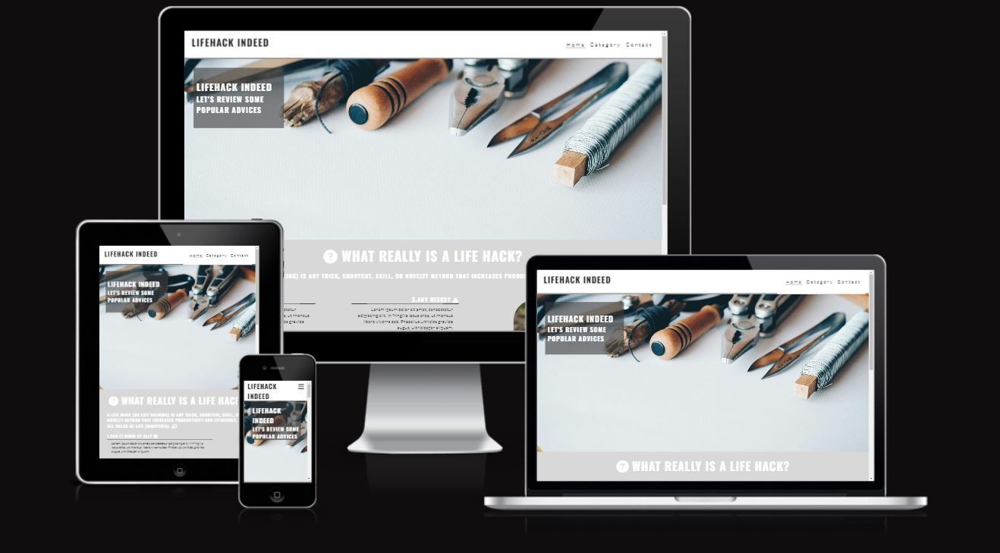
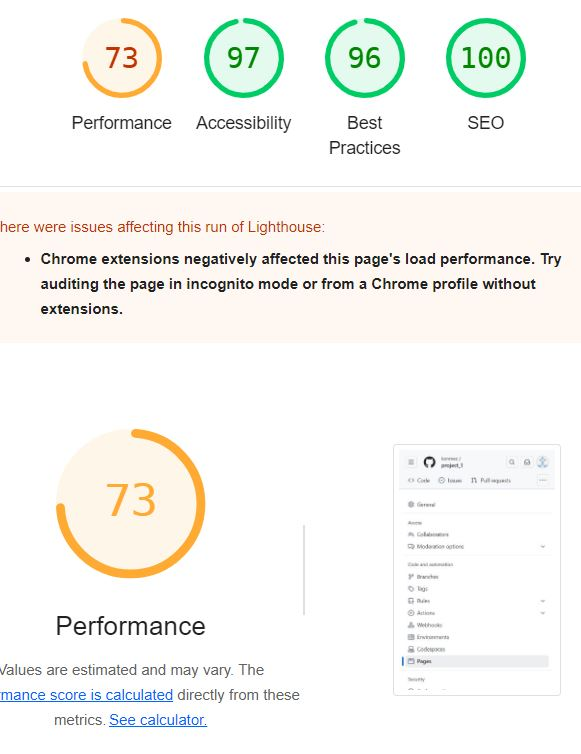

To check my project, please, click <a href="https://konmez.github.io/project_1/" target="_blank">this link.</a>

Snippet from amiresponsive :
.


Snippet about perfomance :



# Simple Webpage Project

A simple, clean, responsive webpage template with basic HTML and CSS styling.

## Features

- Responsive design
- Modern color scheme
- Header with Navigation menu
- Hero section
- Content cards
- Footer

## Getting Started

1. Clone this repository
2. Open `index.html` in your browser
3. Modify the content to suit your needs

## File Structure

```
├── index.html
├──contact.html
├──diy.html
├──household.html
├──kitchen.html
├──other.html
├── README.md
├──css/styles.css

```


## Credits

This project includes work from the following sources:

- Original template design by Code Institute 
  [Code-Institute-Solutions/love-running-v3](https://github.com/Code-Institute-Solutions/love-running-v3)
- Icons from [Font Awesome](https://fontawesome.com) 
- Images from [Unsplash](https://unsplash.com)
 
